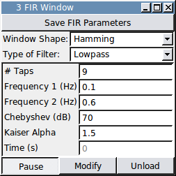

###FIR Filter Design (Window)

**Requirements:** GSL, Qwt, DSP helper files (included), Boost library  
**Limitations:** There is a limit to how high a filter order you can use. This module does not test if your filter order will break real-time.  



This module creates an in-line FIR filter that can be applied to any signal in RTXI. Given the desired number of filter taps (filter order + 1), it computes the impulse response for a lowpass, highpass, bandpass, or bandstop filter using the window method. For a lowpass or highpass filter, the module uses the first frequency as the cut-off frequency. For a bandpass or bandstop filter, both input frequencies are used to define the frequency band. The module initially computes an ideal FIR filter to which you can apply a Triangular (or Bartlett), Hamming, Hann, Kaiser, or Dolph-Chebyshev window. The Hann window is not to be confused with the Hanning window (see MATLAB’s hann() vs. hanning() functions). To apply no window to the filter, choose the Rectangular filter. The Kaiser and Chebyshev windows each take a parameter that determines the attenuation of the sidelobes in the filter. The algorithms only accept an odd number of filter taps. If you enter an even number, the module will automatically add 1 to the number of filter taps.

This module uses a circular buffer from the Boost library for storing recent input samples. You can install these libraries in Ubuntu with:

````
$ sudo apt-get install libboost-dev
````
